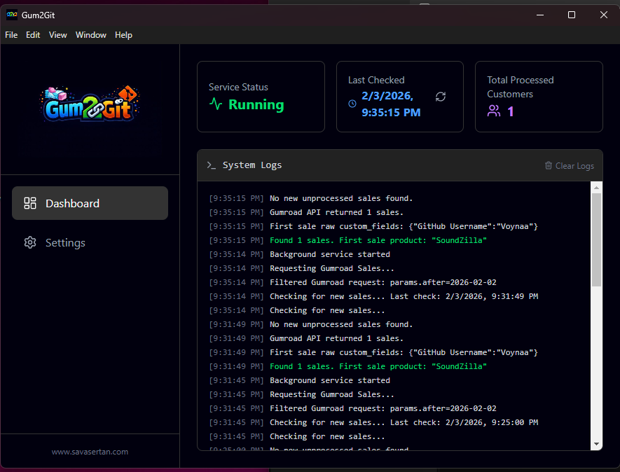

# Gum2Git

<div align="center">
  
  <br />
  <br />

  **Automate GitHub repository access for your Gumroad customers.**

  Gum2Git is a desktop application designed for creators who sell code or digital assets on Gumroad. It automatically invites your customers to a private GitHub repository immediately after they make a purchase.

  [Downloads](#) • [Features](#features) • [Installation](#installation--usage)
</div>

---

## 📸 Preview

<div align="center">
  
  
</div>

---

## 🚀 Features

- **🔄 Automated Sync**: Runs in the background (system tray) and checks for new Gumroad sales at regular intervals.
- **⚡ Instant Access**: Automatically sends GitHub collaboration invites to verified customers using their email.
- **🖥️ Desktop App**: Built with Electron for a native experience on Windows.
- **⚙️ Easy Configuration**: Simple interface to manage your Gumroad and GitHub API tokens.
- **🔒 Secure**: Your API tokens are stored locally on your machine using strict encryption.
- **🌑 Dark Mode**: Sleek dark interface for comfortable usage.

---

## 🛠️ Prerequisites

Before you start, ensure you have the following:

1. **Gumroad Account**:
   - You must have a product created on Gumroad.
   - You need a **Gumroad Access Token**.
     - Go to `Settings` -> `Advanced` -> `Applications`.
     - Create a new application to generate your Access Token.

2. **GitHub Account**:
   - You need a private repository that you want to share.
   - You need a **Personal Access Token (Classic)**.
     - Go to `Settings` -> `Developer settings` -> `Personal access tokens` -> `Tokens (classic)`.
     - Generate a new token.
     - **CRITICAL**: You MUST check the `repo` scope box for private repo access.

---

## 📦 Installation & Usage

1. **Download**: Get the latest release from the [Releases page](https://github.com/denizsavasertan/Gum2Git/releases).
2. **Run**: Launch `Gum2Git Setup.exe`. The app will minimize to the system tray. Double-click the tray icon to open the dashboard.
3. **Configure**:
   - Go to the **Settings** tab.
   - Enter your **Gumroad Access Token**.
   - Enter your **GitHub Personal Access Token** & Repo details.
   - Click **Save**.
4. **Start**:
   - Click **Test Connections** to verify your tokens.
   - If successful, Gum2Git will start monitoring immediately.

---

## 💻 For Developers

If you want to modify or build the project yourself:

### 1. Clone the repository
```bash
git clone https://github.com/denizsavasertan/Gum2Git.git
cd Gum2Git
```

### 2. Install dependencies
```bash
npm install
```

### 3. Run in Development Mode
```bash
npm run dev
```

### 4. Build for Production
To create the `.exe` installer:
```bash
npm run build
```

---

## 🏗️ Technology Stack

- **Electron**: Desktop application framework.
- **React**: UI library for the dashboard.
- **TypeScript**: Type-safe code.
- **Vite**: Ultra-fast build tool.
- **TailwindCSS**: Styling and design system.

---

## 📝 License

Proprietary Software. All rights reserved.
Developed by [Savas Ertan](https://www.savasertan.com)
